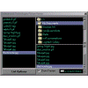



## View Pictures using HTML in VB

### Description

This searches a givin directory for .jpg .bmp .gif and can be edited to search for other picture formats as well. It then lists all pictures found in a listbox. Click the checkbox to preview each picture 1 at a time in Microsoft Internet Control(Web Control).

Please Vote!

underground technologies

u_tech@excite.com
 
### More Info
 
you must have SHDOCVW.DLL to use this sample.

             |
---                |---
**Submitted On**   |2001-07-29 04:31:34
**By**             |[underground technologies](https://github.com/Planet-Source-Code/PSCIndex/blob/master/ByAuthor/underground-technologies.md)
**Level**          |Beginner
**User Rating**    |5.0 (20 globes from 4 users)
**Compatibility**  |VB 4\.0 \(32\-bit\), VB 5\.0, VB 6\.0
**Category**       |[Files/ File Controls/ Input/ Output](https://github.com/Planet-Source-Code/PSCIndex/blob/master/ByCategory/files-file-controls-input-output__1-3.md)
**World**          |[Visual Basic](https://github.com/Planet-Source-Code/PSCIndex/blob/master/ByWorld/visual-basic.md)
**Archive File**   |[View Pictu237057292001\.zip](https://github.com/Planet-Source-Code/underground-technologies-view-pictures-using-html-in-vb__1-25622/archive/master.zip)

